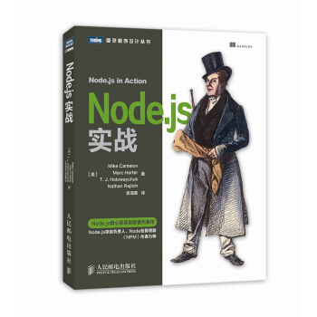

3-17 通过 Node.js API 启动 Webpack
==============================

Webpack 除了提供可执行的命令行工具外，还提供可在 Node.js 环境中调用的库。 通过 Webpack 暴露的 API，可直接在 Node.js 程序中调用 Webpack 执行构建。

想深入学习 深入 Node.js，推荐《Node.js实战》：

[](http://union-click.jd.com/jdc?d=wFYZhH)

通过 API 去调用并执行 Webpack 比直接通过可执行文件启动更加灵活，可用在一些特殊场景，下面将教你如何使用 Webpack 提供的 API。

> Webpack 其实是一个 Node.js 应用程序，它全部通过 JavaScript 开发完成。 在命令行中执行 `webpack` 命令其实等价于执行 `node ./node_modules/webpack/bin/webpack.js`。

安装和使用 Webpack 模块
----------------

在调用 Webpack API 前，需要先安装它：

```bash
npm i -D webpack

```

安装成功后，可以采用以下代码导入 Webpack 模块：

```js
const webpack = require('webpack');

// ES6 语法
import webpack from "webpack";

```

导出的 `webpack` 其实是一个函数，使用方法如下：

```js
webpack({
  // Webpack 配置，和 webpack.config.js 文件一致
}, (err, stats) => {
  if (err || stats.hasErrors()) {
    // 构建过程出错
  }
  // 成功执行完构建
});

```

如果你的 Webpack 配置写在 `webpack.config.js` 文件中，可以这样使用：

```js
// 读取 webpack.config.js 文件中的配置
const config = require('./webpack.config.js');
webpack(config , callback);

```

以监听模式运行
-------

以上使用 Webpack API 的方法只能执行一次构建，无法以监听模式启动 Webpack，为了在使用 API 时以监听模式启动，需要获取 Compiler 实例，方法如下：

```js
// 如果不传 callback 回调函数，就会返回一个 Compiler 实例，用于让你去控制启动，而不是像上面那样立即启动
const compiler = webpack(config);

// 调用 compiler.watch 以监听模式启动，返回的 watching 用于关闭监听
const watching = compiler.watch({
  // watchOptions
  aggregateTimeout: 300,
},(err, stats)=>{
  // 每次因文件发生变化而重新执行完构建后
});

// 调用 watching.close 关闭监听 
watching.close(()=>{
  // 在监听关闭后
});

```

其中的 watchOptions 就是在 [2-7 其它配置项](../2配置/2-7其它配置项.html) 中介绍过的 _Watch 和 WatchOptions_。

> 本实例<a href="../zip/3-17通过Node.jsAPI启动Webpack.zip" target="_blank">提供项目完整代码</a>
