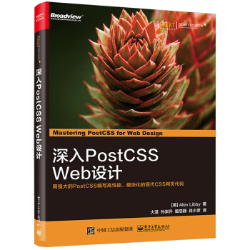

3-5 使用 PostCSS
==============

认识 PostCSS
----------

[PostCSS](http://postcss.org) 是一个 CSS 处理工具，和 SCSS 不同的地方在于它通过插件机制可以灵活的扩展其支持的特性，而不是像 SCSS 那样语法是固定的。 PostCSS 的用处非常多，包括给 CSS 自动加前缀、使用下一代 CSS 语法等，目前越来越多的人开始用它，它很可能会成为 CSS 预处理器的最终赢家。

> PostCSS 和 CSS 的关系就像 Babel 和 JavaScript 的关系，它们解除了语法上的禁锢，通过插件机制来扩展语言本身，用工程化手段给语言带来了更多的可能性。
> 
> PostCSS 和 SCSS 的关系就像 Babel 和 TypeScript 的关系，PostCSS 更加灵活、可扩张性强，而 SCSS 内置了大量功能而不能扩展。

想深入学习 深入 PostCSS，推荐《深入PostCSS Web设计》：

[](http://union-click.jd.com/jdc?d=hKtbgE)

为了更直观的展示 PostCSS，让我们来看一些例子。

给 CSS 自动加前缀，增加各浏览器的兼容性：

```css
/*输入*/
h1 {
  display: flex;
}

/*输出*/
h1 {
  display: -webkit-box;
  display: -webkit-flex;
  display: -ms-flexbox;
  display: flex;
}

```

使用下一代 CSS 语法：

```css
/*输入*/
:root {
  --red: #d33;
}

h1 {
  color: var(--red);
}


/*输出*/
h1 { 
  color: #d33;
}

```

PostCSS 全部采用 JavaScript 编写，运行在 Node.js 之上，即提供了给 JavaScript 代码调用的模块，也提供了可执行的文件。 在 PostCSS 启动时，会从目录下的 `postcss.config.js` 文件中读取所需配置，所以需要新建该文件，文件内容大致如下：

```js
module.exports = {
  plugins: [
    // 需要使用的插件列表
    require('postcss-cssnext')
  ]
}

```

其中的 [postcss-cssnext](http://cssnext.io) 插件可以让你使用下一代 CSS 语法编写代码，再通过 PostCSS 转换成目前的浏览器可识别的 CSS，并且该插件还包含给 CSS 自动加前缀的功能。

> 目前 Chrome 等现代浏览器已经能完全支持 cssnext 中的所有语法，也就是说按照 cssnext 语法写的 CSS 在不经过转换的情况下也能在浏览器中直接运行。

接入 Webpack
----------

虽然使用 PostCSS 后文件后缀还是 `.css` 但这些文件必须先交给 [postcss-loader](https://github.com/postcss/postcss-loader) 处理一遍后再交给 css-loader。

接入 PostCSS 相关的 Webpack 配置如下：

```js
module.exports = {
  module: {
    rules: [
      {
        // 使用 PostCSS 处理 CSS 文件
        test: /\.css/,
        use: ['style-loader', 'css-loader', 'postcss-loader'],
      },
    ]
  },
};

```

接入 PostCSS 给项目带来了新的依赖需要安装，如下：

```bash
# 安装 Webpack Loader 依赖
npm i -D postcss-loader css-loader style-loader
# 根据你使用的特性安装对应的 PostCSS 插件依赖
npm i -D postcss-cssnext

```

> 本实例<a href="../zip/3-5使用PostCSS.zip" target="_blank">提供项目完整代码</a>