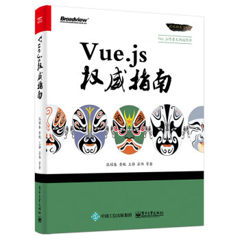

3-7 使用 Vue 框架
=============

[Vue](https://cn.vuejs.org) 是一个渐进式的 MVVM 框架，相比于 React、Angular 它更灵活轻量。 它不会强制性地内置一些功能和语法，你可以根据自己的需要一点点地添加功能。 虽然采用 Vue 的项目能用可直接运行在浏览器环境里的代码编写，但为了方便编码大多数项目都会采用 Vue 官方的[单文件组件](https://cn.vuejs.org/v2/guide/single-file-components.html#介绍)的写法去编写项目。 由于直接引用 Vue 是古老和成熟的做法，本书只专注于讲解如何用 Webpack 构建 Vue 单文件组件。

认识 Vue
------

Vue 和 React 一样，它们都推崇组件化和由数据驱动视图的思想，视图和数据绑定在一起，数据改变视图会跟着改变，而无需直接操作视图。 还是以前面的 `Hello,Webpack` 为例，来看下 Vue 版本的实现。

`App.vue` 文件代表一个单文件组件，它是项目唯一的组件，也是根组件：

```html
<!--渲染模版-->
<template>
  <h1>{{ msg }}</h1>
</template>

<!--样式描述-->
<style scoped>
  h1 {
    color: red;
  }
</style>

<!--组件逻辑-->
<script>
  export default {
    data() {
      return {
        msg: 'Hello,Webpack'
      }
    }
  }
</script>

```

Vue 的单文件组件通过一个类似 HTML 文件的 `.vue` 文件就能描述清楚一个组件所需的模版、样式、逻辑。

`main.js` 入口文件：

```js
import Vue from 'vue'
import App from './App.vue'

new Vue({
  el: '#app',
  render: h => h(App)
});

```

入口文件创建一个 Vue 的根实例，在 ID 为 `app` 的 DOM 节点上渲染出上面定义的 `App` 组件。

想深入学习 深入 Vue，推荐《Vue.js权威指南》：

[](http://union-click.jd.com/jdc?d=Fdmv9t)

接入 Webpack
----------

目前最成熟和流行的开发 Vue 项目的方式是采用 ES6 加 Babel 转换，这和基本的采用 ES6 开发的项目很相似，差别在于要解析 `.vue` 格式的单文件组件。 好在 Vue 官方提供了对应的 [vue-loader](https://vue-loader.vuejs.org/zh-cn/) 可以非常方便的完成单文件组件的转换。

修改 Webpack 相关配置如下：

```js
module: {
  rules: [
    {
      test: /\.vue$/,
      use: ['vue-loader'],
    },
  ]
}

```

安装新引入的依赖：

```bash
# Vue 框架运行需要的库
npm i -S vue
# 构建所需的依赖
npm i -D vue-loader css-loader vue-template-compiler

```

在这些依赖中，它们的作用分别是：

*   `vue-loader`：解析和转换 `.vue` 文件，提取出其中的逻辑代码 `script`、样式代码 `style`、以及 HTML 模版 `template`，再分别把它们交给对应的 Loader 去处理。
*   `css-loader`：加载由 `vue-loader` 提取出的 CSS 代码。
*   `vue-template-compiler`：把 `vue-loader` 提取出的 HTML 模版编译成对应的可执行的 JavaScript 代码，这和 React 中的 JSX 语法被编译成 JavaScript 代码类似。预先编译好 HTML 模版相对于在浏览器中再去编译 HTML 模版的好处在于性能更好。

重新启动构建你就能看到由 Vue 渲染出的 `Hello,Webpack` 了。

> 本实例<a href="../zip/3-7使用Vue框架Babel.zip" target="_blank">提供项目完整代码</a>

使用 TypeScript 编写 Vue 应用
-----------------------

从 Vue 2.5.0+ 版本开始，提供了对 TypeScript 的良好支持，使用 TypeScript 编写 Vue 是一个很好的选择，因为 TypeScript 能检查出一些潜在的错误。 下面讲解如何用 Webpack 构建使用 TypeScript 编写的 Vue 应用。

新增 `tsconfig.json` 配置文件，内容如下：

```json
{
  "compilerOptions": {
    // 构建出 ES5 版本的 JavaScript，与 Vue 的浏览器支持保持一致
    "target": "es5",
    // 开启严格模式，这可以对 `this` 上的数据属性进行更严格的推断
    "strict": true,
    // TypeScript 编译器输出的 JavaScript 采用 es2015 模块化，使 Tree Shaking 生效
    "module": "es2015",
    "moduleResolution": "node"
  }
}

```

以上代码中的 `"module": "es2015"` 是为了 Tree Shaking 优化生效，阅读 [4-10 使用 TreeShaking](../4优化/4-10使用TreeShaking.html) 进一步了解。

修改 `App.vue` 脚本部分内容如下：

```html
<!--组件逻辑-->
<script lang="ts">
  import Vue from "vue";

  // 通过 Vue.extend 启用 TypeScript 类型推断
  export default Vue.extend({
    data() {
      return {
        msg: 'Hello,Webpack',
      }
    },
  });
</script>

```

注意 script 标签中的 `lang="ts"` 是为了指明代码的语法是 TypeScript。

修改 `main.ts` 执行入口文件为如下：

```typescript
import Vue from 'vue'
import App from './App.vue'

new Vue({
  el: '#app',
  render: h => h(App)
});

```

由于 TypeScript 不认识 `.vue` 结尾的文件，为了让其支持 `import App from './App.vue'` 导入语句，还需要以下文件 `vue-shims.d.ts` 去定义 `.vue` 的类型：

```typescript
// 告诉 TypeScript 编译器 .vue 文件其实是一个 Vue  
declare module "*.vue" {
  import Vue from "vue";
  export default Vue;
}

```

Webpack 配置需要修改两个地方，如下：

```js
const path = require('path');

module.exports = {
  resolve: {
    // 增加对 TypeScript 的 .ts 和 .vue 文件的支持
    extensions: ['.ts', '.js', '.vue', '.json'],
  },
  module: {
    rules: [
      // 加载 .ts 文件
      {
        test: /\.ts$/,
        loader: 'ts-loader',
        exclude: /node_modules/,
        options: {
          // 让 tsc 把 vue 文件当成一个 TypeScript 模块去处理，以解决 moudle not found 的问题，tsc 本身不会处理 .vue 结尾的文件
          appendTsSuffixTo: [/\.vue$/],
        }
      },
    ]
  },
};

```

除此之外还需要安装新引入的依赖：

```bash
npm i -D ts-loader typescript

```

> 本实例<a href="../zip/3-7使用Vue框架TypeScript.zip" target="_blank">提供项目完整代码</a>