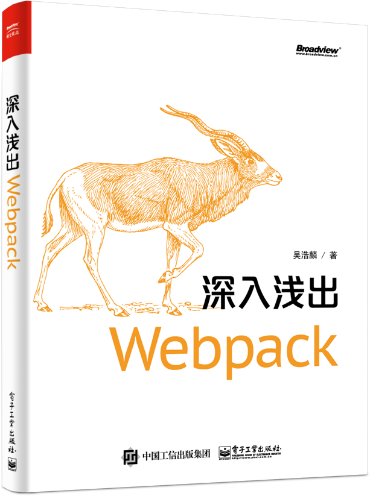

深入浅出 Webpack
============

  

评价
--

> Webpack 凭借强大的功能与良好的使用体验，已经成为目前最流行，社区最活跃的打包工具，是现代 Web 开发必须掌握的技能之一。作者结合自身的实战经验，介绍了 Webpack 的使用与常见优化方法、并深入讲解了 Webpack 原理与架构，相信各阶段的 Webpack 用户都能通过本书得到启发。
> 
> \-\- [LeanCloud](https://leancloud.cn?utm_source=webpack_book&utm_campaign=landing) 联合创始人/CEO 江宏
> 
> 本书的内容包含多个主题，Webpack 的用法、配置、使用场景等都有涉及，并且提供所有示例的源码，可以补充 Webpack 官方文档。
> 
> \-\- 阮一峰（[著名技术博客](http://www.ruanyifeng.com/blog/)，[《ES6 标准入门》](http://union-click.jd.com/jdc?d=Vaj3NC)的作者）
> 
> 我手边需要这样一本书，内容涵盖Webpack，或者说涵盖现代前端技术基础、构建与优化的方方面面。如果你已经上手 Webpack，那么本书将带领你进一步学习，真正掌握 Webpack！
> 
> \-\- 陆金所前端架构师、[前端外刊评论](https://qianduan.group/)站长 寸志

版权许可
----

电子工业出版社持有本书全媒体形式的出版发行权利。

[吴浩麟](https://github.com/gwuhaolin)拥有本书的著作权。

**其它人不能将本书用于商用用途，不能转载，不能以任何形式发行，违者将追究法律责任**。

目录
--

*   [前言](前言.html)

### [第1章 入门](1入门/)

*   [1-1 前端的发展](1入门/1-1前端的发展.html)
*   [1-2 常见的构建工具及对比](1入门/1-2常见的构建工具及对比.html)
*   [1-3 安装与使用](1入门/1-3安装与使用.html)
*   [1-4 使用 Loader](1入门/1-4使用Loader.html)
*   [1-5 使用 Plugin](1入门/1-5使用Plugin.html)
*   [1-6 使用 DevServer](1入门/1-6使用DevServer.html)
*   [1-7 核心概念](1入门/1-7核心概念.html)

### [第2章 配置](2配置/)

*   [2-1 Entry](2配置/2-1Entry.html)
*   [2-2 Output](2配置/2-2Output.html)
*   [2-3 Module](2配置/2-3Module.html)
*   [2-4 Resolve](2配置/2-4Resolve.html)
*   [2-5 Plugins](2配置/2-5Plugins.html)
*   [2-6 DevServer](2配置/2-6DevServer.html)
*   [2-7 其它配置项](2配置/2-7其它配置项.html)
*   [2-8 整体配置结构](2配置/2-8整体配置结构.html)
*   [2-9 多种配置类型](2配置/2-9多种配置类型.html)
*   [2-10 配置总结](2配置/2-10配置总结.html)

### [第3章 实战](3实战/)

*   [3-1 使用 ES6 语言](3实战/3-1使用ES6语言.html)
*   [3-2 使用 TypeScript 语言](3实战/3-2使用TypeScript语言.html)
*   [3-3 使用 Flow 检查器](3实战/3-3使用Flow检查器.html)
*   [3-4 使用 SCSS](3实战/3-4使用SCSS语言.html)
*   [3-5 使用 PostCSS](3实战/3-5使用PostCSS.html)
*   [3-6 使用 React 框架](3实战/3-6使用React框架.html)
*   [3-7 使用 Vue 框架](3实战/3-7使用Vue框架.html)
*   [3-8 使用 Angular2 框架](3实战/3-8使用Angular2框架.html)
*   [3-9 为单页应用生成 HTML](3实战/3-9为单页应用生成HTML.html)
*   [3-10 管理多个单页应用](3实战/3-10管理多个单页应用.html)
*   [3-11 构建同构应用](3实战/3-11构建同构应用.html)
*   [3-12 构建 Electron 应用](3实战/3-12构建Electron应用.html)
*   [3-13 构建 Npm 模块](3实战/3-13构建Npm模块.html)
*   [3-14 构建离线应用](3实战/3-14构建离线应用.html)
*   [3-15 搭配 Npm Script](3实战/3-15搭配NpmScript.html)
*   [3-16 检查代码](3实战/3-16检查代码.html)
*   [3-17 通过 Node.js API 启动 Webpack](3实战/3-17通过Node.jsAPI启动Webpack.html)
*   [3-18 使用 Webpack Dev Middleware](3实战/3-18使用WebpackDevMiddleware.html)
*   [3-19 加载图片](3实战/3-19加载图片.html)
*   [3-20 加载SVG](3实战/3-20加载SVG.html)
*   [3-21 加载 Source Map](3实战/3-21加载SourceMap.html)
*   [3-22 实战总结](3实战/3-22实战总结.html)

### [第4章 优化](4优化/)

*   [4-1 缩小文件搜索范围](4优化/4-1缩小文件搜索范围.html)
*   [4-2 使用 DllPlugin](4优化/4-2使用DllPlugin.html)
*   [4-3 使用 HappyPack](4优化/4-3使用HappyPack.html)
*   [4-4 使用 ParallelUglifyPlugin](4优化/4-4使用ParallelUglifyPlugin.html)
*   [4-5 自动刷新与模块热替换](4优化/4-5使用自动刷新.html)
*   [4-6 开启模块热替换](4优化/4-6开启模块热替换.html)
*   [4-7 区分环境](4优化/4-7区分环境.html)
*   [4-8 压缩代码](4优化/4-8压缩代码.html)
*   [4-9 CDN 加速](4优化/4-9CDN加速.html)
*   [4-10 使用 Tree Shaking](4优化/4-10使用TreeShaking.html)
*   [4-11 提取公共代码](4优化/4-11提取公共代码.html)
*   [4-12 按需加载](4优化/4-12按需加载.html)
*   [4-13 使用 Prepack](4优化/4-13使用Prepack.html)
*   [4-14 开启 Scope Hoisting](4优化/4-14开启ScopeHoisting.html)
*   [4-15 输出分析](4优化/4-15输出分析.html)
*   [4-16 优化总结](4优化/4-16优化总结.html)

### [第5章 原理](5原理/)

*   [5-1 工作原理概括](5原理/5-1工作原理概括.html)
*   [5-2 输出文件分析](5原理/5-2输出文件分析.html)
*   [5-3 编写 Loader](5原理/5-3编写Loader.html)
*   [5-4 编写 Plugin](5原理/5-4编写Plugin.html)
*   [5-5 调试 Webpack](5原理/5-5调试Webpack.html)
*   [5-6 原理总结](5原理/5-6原理总结.html)

### 附录

*   [常用 Loaders](附录/常用Loaders.html)
*   [常用 Plugins](附录/常用Plugins.html)
*   [其它 Webpack 学习资源](附录/其它Webpack学习资源.html)

* * *
